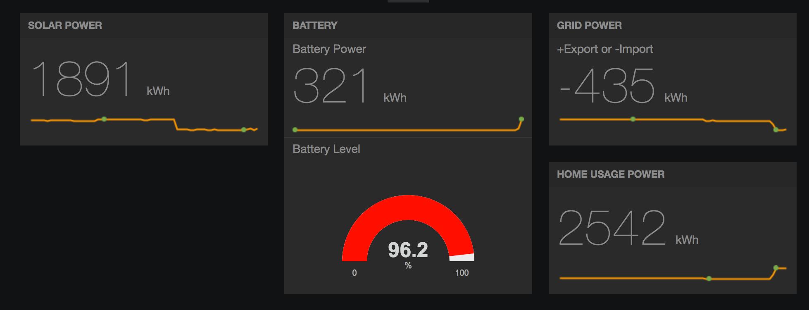
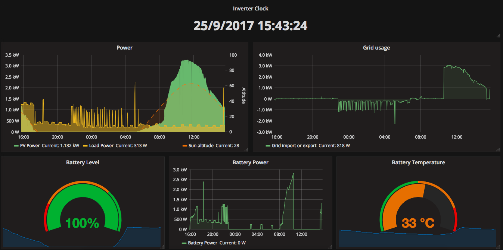
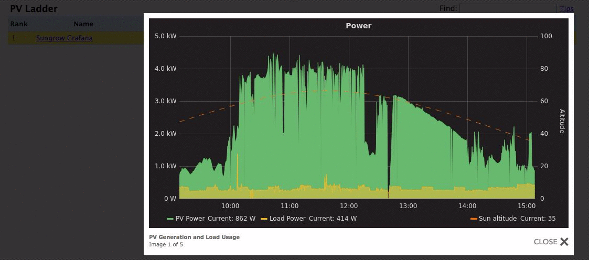

# Solariot

Leverage your IoT enabled Solar PV Inverter to stream your solar energy usage
data to a real time dashboard.

Solariot will connect directly to your Inverter using Modbus TCP. 

Currently, Solariot is able to talk to a SMA Sunny Boy and Sungrow SH5K inverter. However,
the script is designed to allow any Modbus TCP enabled Inverter to be queried by
using your own Modbus register map file.

Once the Inverter has been queried, data is collected and stream to two optional
destinations: dweet.io and / or an InfluxDB. From there, you will need to create
your own dashboard, such as Freeboard and Grafana. 

Here's an example use case with [Freeboard](https://freeboard.io/board/YQ35fW) as a real 
time dashboard and data visualization tool for a Sungrow Inverter (and attached
battery) system:



With [Grafana](https://solar.mellican.com):



## Pre-requisites

The Inverter must be accessible on the network using TCP.

This script should work on most Inverters that talk Modbus TCP. You can 
customise your own modbus register file.

Install the required Python libraries for pymodbus, dweepy and influxdb:

```
pip install -r requirements.txt
```

## Installation

1. Download or clone this repository to your local workstation. Install the 
required libraries (see Pre-requisites section above).

2. Update the config.py with your values, such as the Inverter's IP address, 
port, inverter model (which corresponds to the modbus register file) and the
register addresses Solariot should scan from.

3. Run the solariot.py script.

## Troubleshooting

*[ERROR] 'ModbusIOException' object has no attribute 'registers'*
Check your Inverter's "address" (as opposed to IP address) matches the slave 
id in the config file. Default is 0x01.

## Next Steps

Now that you are collecting the inverter's data, you'll want to ultimately
display it in a dashboard as seen above. 

There are many methods to stream the data. Here are a couple options, which
both can be enabled in Solariot. Let me know if you have other methods, such
as MQTT as the pub/sub service or another IoT Time Series database.

### Dweet.io and Freeboard

This is the quickest method and is a good place to start.

Metrics are streamed to dweet.io a free IoT messaging service. No sign up is 
required. All you need to do is create a unique identifier by updating the
dweepy_uuid value in the config.py file.

Data can then be visualised using a free dashboard service from 
[Freeboard](https://freeboard.io/). You'll need to create your own dashboard,
using dweet.io as your data source.

### MQTT Support

This is a good way to push data to MQTT topics that you might subscribe various tools 
such as Node-Red or Home Assistant to. Running your own MQTT server will mean you can
also retrieve these values when your internet is offline.

All you need to do is to set the `mqtt_server`, `mqtt_port` and `mqtt_topic` values in
`config.py` file and you'll be up and running.

### InfluxDB and Grafana

Use a time series database such as 
[InfluxDB](https://github.com/influxdata/influxdb) to store the inverter data as
it streams in. You'll need to install this on your own server.

To display the data in real time dashboard, you can use 
[Grafana](https://grafana.com/get) to pull the metrics from InfluxDB. You can 
either install your own Grafana server or use their free 
[Grafana hosted solution](https://grafana.com/cloud/grafana).

A json export of solarspy.live Grafana dashboard is available under the grafana folder.

## Integration with PVOutput.org and Grafana

If you are using Grafana as your dashboard, a neat little trick is to then
incorporate your Grafana panels with your PVOutput as system photos. From your
[PV Ladder page](https://pvoutput.org/ladder.jsp?f=1&pf=4102&pt=4102&sf=5130&st=5130&country=1&in=Sungrow&pn=Infinity&io=1&oc=0), click on your photos to view the real time Grafana images: 



1. Obtain your Grafana panel direct link, see their documentation: <http://docs.grafana.org/reference/sharing/#direct-link-rendered-image>.

2. In your PVOutput "Edit System" page, add your Grafana panel link in the 
"Image Link" field. Append "&png" to the link. Note, if the URL is longer than 
100 characters, use a URL shortener service instead (such as <https://goo.gl>).
Don't forget to append the "&png" string to your URL.

3. Now go to your system in the PV Ladder page and click on the photos.

:bulb: Tip: You can add any URL image, such as the latest weather radar image 
:wink:

## Contributions

If you have created a modbus register map for an inverter, please submit your
file as a pull request for Solariot inclusion.
